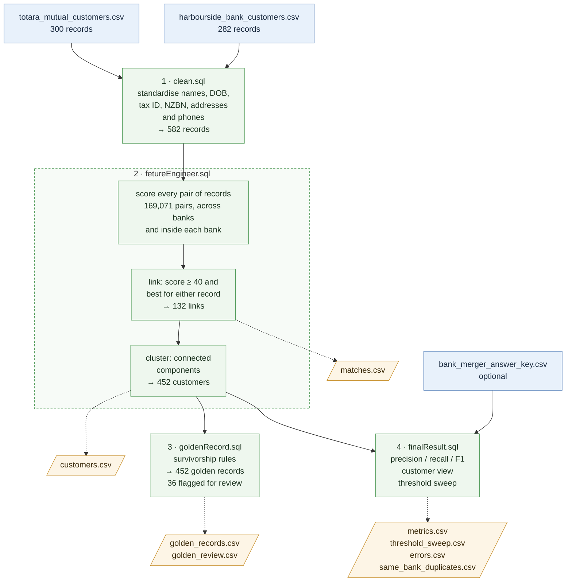

## DATA MATCHMAKERS (Team-8)

## Kendrix Entity Resolution — Solution Summary

### Objective

The solution addresses the challenge of identifying customer records that represent the same real-world entity across two banking systems: **Totara Mutual** and **Harbourside Bank**. The objective is to transform inconsistent source records into a standardised customer view, identify potential matches using multiple identity attributes, assign a confidence score, and evaluate matching performance against a known answer set.

### Pipeline



Blue boxes are inputs, green boxes are processing steps (the dashed box groups the three stages in `fetureEngineer.sql`), and orange boxes are the files written to `output/`. Evaluation (step 4) runs only when the answer key is present. The numbers are from the current data at `match_threshold = 40`.

The SQL files run in this order, locally in one in-memory DuckDB database. The same steps written for Snowflake are in `snowflake/` (see [Run on Snowflake](#run-on-snowflake)).

| Step | File | Main tables |
| --- | --- | --- |
| 1 | `clean.sql` | `clean.totara`, `clean.harbourside`, `clean.records` (both banks), `clean.phones` |
| 2 | `fetureEngineer.sql` | `clean.customer_match_features`, `clean.customer_match_score`, `clean.customer_match_results` (links), `clean.customer_clusters` (customers) |
| 3 | `goldenRecord.sql` | `clean.record_profile`, `clean.golden_record`, `clean.golden_review` |
| 4 | `finalResult.sql` (only with the answer key) | `clean.match_metrics`, `clean.customer_metrics`, `clean.threshold_sweep`, `clean.same_bank_duplicates` |

### Run locally

The whole pipeline runs locally with [DuckDB](https://duckdb.org). No Snowflake is needed.

```bash
python3 -m venv .venv
.venv/bin/pip install -r requirements.txt
.venv/bin/python run_local.py                 # uses ./bank_merger_answer_key.csv if present
.venv/bin/python run_local.py path/to/key.csv # or an explicit answer key
```

`bank_merger_answer_key.csv` is an export of `PUBLIC.BANK_MERGER_ANSWER_KEY` with the columns `BANK, CUSTOMER_ID, TRUEENTITYID`. Without it, the pipeline still produces matches but skips evaluation.

Outputs, written to `output/`:

* `customers.csv`: the standardised customer view, with one row per record and its `cluster_id` (the real customer it belongs to).
* `golden_records.csv`: one merged row per real customer, with name, identifiers, address, contact details, status, balances and products, plus the source records and any `review_reasons`.
* `golden_review.csv`: the golden records that need a data steward's check. It has one row per source record, next to the merged value, with the reason and which record supplied the name and address.
* `matches.csv`: every link between two records, with all evidence columns and its score.
* `metrics.csv`: precision, recall and F1 overall, per pair type and per entity type (requires the answer key).
* `threshold_sweep.csv`: the same metrics at each score threshold (requires the answer key).
* `errors.csv`: every false positive and false negative, for review (requires the answer key).
* `same_bank_duplicates.csv`: the original CSV rows of the 9 customers held twice in one bank and not at all in the other, with the `cluster_id` they now share (requires the answer key; see [Duplicates inside one bank](#duplicates-inside-one-bank)).

### Run on Snowflake

`snowflake/` holds the same four steps written in Snowflake SQL. They build the same `clean.*` tables with the same rules. They read `BANK.PUBLIC.TOTARA_MUTUAL_CUSTOMERS`, `BANK.PUBLIC.HARBOURSIDE_BANK_CUSTOMERS` and `BANK.PUBLIC.BANK_MERGER_ANSWER_KEY`, and write to the schema `BANK.CLEAN`, replacing any tables there with the same names.

Two ways to run it:

* **Snowsight worksheet:** run `snowflake/clean.sql`, `fetureEngineer.sql`, `goldenRecord.sql` and `finalResult.sql`, in that order.
* **Runner script:** runs the four files, prints the same checks as `run_local.py`, and writes the same CSVs to `output/snowflake/`. It connects with a connection defined in `~/.snowflake/connections.toml`. The connection needs a warehouse, and a role that can read `BANK.PUBLIC` and create `BANK.CLEAN`.

```bash
.venv/bin/pip install -r snowflake/requirements.txt
.venv/bin/python snowflake/run_snowflake.py <connection_name>   # default: "default"
```

Where the two dialects differ:

| DuckDB (local) | Snowflake |
| --- | --- |
| CSV read as text | `clean.raw_totara` / `clean.raw_harbourside` copy every column as text. `CUST_NO` is padded back to 8 digits and postcodes to 4, in case the tables store them as numbers. |
| `strip_accents`, `damerau_levenshtein` | JavaScript UDFs with the same names. `EDITDISTANCE` would count a swapped digit pair as 2 edits, not 1. |
| `jaro_winkler_similarity` (0–1) | `JAROWINKLER_SIMILARITY / 100`. The Snowflake function returns whole numbers from 0 to 100, so similarities are rounded to 0.01. |
| Table macros `links_at` / `clusters_at` | Links and clusters are computed once for every threshold (`clean.links_by_threshold`, `clean.clusters_by_threshold`). The result and the threshold sweep both read from them. |
| Recursive `UNION` for connected components | Recursive `UNION ALL`. Each path carries the records it has visited, so it cannot loop. |
| `first(x ORDER BY rank) FILTER (WHERE …)` | `MIN_BY(x, IFF(…, rank, NULL))` |
| `concat_ws` (skips missing parts) | `ARRAY_TO_STRING(ARRAY_CONSTRUCT_COMPACT(…), sep)`, because Snowflake's `CONCAT_WS` returns NULL when any part is NULL |

Status: the Snowflake files pass a Snowflake-dialect syntax check (sqlglot) but have not yet been run on a Snowflake account. The results below come from the local DuckDB run.

### 1. Data Cleaning and Standardisation — `clean.sql`

This step loads both CSVs as text, so leading zeros in IDs and postcodes are kept. It then builds `clean.totara` and `clean.harbourside` with a common structure:

* **Entity type:** PERSON or BUSINESS. Businesses use `ENTITY_NAME` / `business_name`, and Harbourside's `trading_name` is kept as well.
* **Person names** are split into first and last name. Totara's `"WHITE, OLIVER K"` becomes `oliver` / `white`. Accents and middle names or initials are dropped.
* **Business names** are lower-cased, with accents (`Kōwhai`), punctuation and `Ltd`/`Limited` removed.
* **DOB** is parsed from both formats (`27-OCT-1968`, `2003-05-18`).
* **Tax/IRD numbers** and **NZBN** are reduced to digits only.
* **Street addresses:** `Unit 6, 128 …` → `6/128 …`, and suffixes are standardised (`Crescent` → `cres`, `Terrace` → `tce`, …). **Postcodes** are extracted.
* **Phones:** `clean.phones` holds one row per number, converted to national format (`+6421…` → `021…`). A customer's two numbers are matched separately, not concatenated.

### 2. Feature Engineering — `fetureEngineer.sql`

Both banks are stacked into `clean.records`, and **every record is compared with every other record**. That covers pairs across the banks (300 × 282 = 84,600) and pairs inside each bank (44,850 + 39,621). The within-bank pairs matter because some customers have duplicate records in one bank: Totara 00401592 and 00404631 are both David Pohatu, and the duplicate has no tax ID. In total, 169,071 pairs are scored. There is no blocking step, so no true match can be lost before scoring. `clean.customer_match_features` holds these features:

| Feature | Meaning |
| --- | --- |
| `tax_match` / `tax_near` / `tax_conflict` | IRD equal / one typo or transposed digit away / clearly different |
| `nzbn_match` / `nzbn_conflict` | NZBN equal / different |
| `dob_match` / `dob_conflict` | DOB equal / different |
| `phone_match` | any phone number shared |
| `name_similarity` | Jaro-Winkler on first + last name (persons), or on business / trading name (businesses) |
| `address_similarity`, `postcode_match` | Jaro-Winkler on the normalised street, and postcode equality |
| `type_conflict` | a person compared with a business |

### 3. Confidence Scoring and Matching

`clean.customer_match_score` adds up the evidence. Missing values contribute 0, and conflicting values subtract points:

| Evidence | Points |
| --- | ---: |
| Tax ID match / near / conflict | +50 / +30 / −40 |
| NZBN match / conflict | +50 / −40 |
| DOB match / conflict | +20 / −25 |
| Phone match | +20 |
| Name similarity (scaled from 0.7 to 1.0 JW) | 0 … +30 |
| Street similarity ≥ 0.9 | +10 |
| Postcode match | +5 |
| Person vs business | −50 |

Pairs with `match_score >= match_threshold` (set at the top of `fetureEngineer.sql`) are candidates. A **best-partner** rule links a pair only if it is the best-scoring pair for *either* of its two records. Requiring both would miss real matches: 12 customers have two records in one bank (for example HB-10637 and HB-11370 are both Mateo Anderson), and both records must link to the one record in the other bank. The links are in `clean.customer_match_results`.

Linked records are then grouped into customers (connected components): if A links to B and B links to C, all three are one customer. `clean.customer_clusters` gives every record a `cluster_id`, which is the standardised customer view.

### 4. Golden Record — `goldenRecord.sql`

`clean.golden_record` merges each customer's records into one row (452 rows for 582 records). `clean.record_profile` first puts every record into one display format: Totara's `"FONOTI, DAVE J"` becomes first / middle / last name, and `6/128 SEAVIEW TCE` becomes `Unit 6, 128 Seaview Terrace`. Codes become names (`A` → Active, `MTG` → Home Loan), and balances become numbers. The survivorship rules are:

| Field | Rule |
| --- | --- |
| Name, gender, DOB, tax ID, NZBN | From the best record by *identity rank*: Harbourside first, then a record with a tax ID, then active, then lowest ID. Harbourside has full, correctly cased names, and all the name typos (Willaims, Malceod) are in Totara. |
| Address, primary email | From the best record by *contact rank*: active records first, since an active relationship is more likely to have the current address. |
| Name block, address block | Each taken whole from one record, so a street is never combined with another record's suburb. |
| Status, AML risk, PEP | The most severe value wins: Deceased > Active > Dormant > Closed, and High > Medium > Low. |
| Accounts, deposits, lending, products | Added up across records, because duplicate records hold different accounts. |
| Other names, emails, phones | All kept (`other_names`, `all_emails`, `phones`), so nothing is lost. |

For example, Totara `FONOTI, DAVE J` (active, no tax ID) and Harbourside `David James Fonoti` (dormant) become one customer. The name comes from Harbourside ("David James Fonoti", with "Dave Fonoti" as another name), the address comes from the active Totara record, the status is Active, and the balances are added up. `name_source`, `address_source` and `source_records` show which record supplied each part.

`review_reasons` flags customers whose records disagree, so a data steward can confirm them (`clean.golden_review` / `golden_review.csv` lists their source records side by side): the address differs (30 customers), the last name differs because of a name change or typo (7), the tax ID differs (2), or one record is deceased while another is active. Checks: every record appears in exactly one golden record, total deposits and lending are the same before and after the merge, and every customer has a name and an address.

### 5. Model Evaluation — `finalResult.sql`

Evaluation is done on customers, not single links. The true pairs are every two records that share a `TRUEENTITYID`, both across banks and inside one bank. The predicted pairs are every two records in the same cluster. A full outer join of the two gives:

* True Positives: predicted and true
* False Positives: predicted but not true (a wrong merge)
* False Negatives: true but not predicted, **including missed duplicates inside one bank**

The step reports precision, recall and F1, overall, per pair type (T-H across banks, T-T and H-H inside a bank) and per entity type. `clean.customer_metrics` checks the customer view directly: how many real customers are exactly one cluster, how many are split across clusters, and how many clusters wrongly merge two customers. Accuracy is not reported: almost all of the 169,071 pairs are true negatives, so accuracy would be close to 100% for any model. A threshold sweep gives the metrics at each cut-off, so the threshold can be chosen by F1. `clean.key_coverage` checks that every answer-key row joins to a cleaned record.

### 6. Current Results

Evaluated against `bank_merger_answer_key.csv` (582 records, 452 real customers, 133 true pairs), at `match_threshold = 40`:

| Segment | TP | FP | FN | Precision | Recall | F1 |
| --- | ---: | ---: | ---: | ---: | ---: | ---: |
| All | 133 | 0 | 0 | 1.00 | 1.00 | 1.00 |
| Pairs across banks (T-H) | 121 | 0 | 0 | 1.00 | 1.00 | 1.00 |
| Duplicates in Totara (T-T) | 6 | 0 | 0 | 1.00 | 1.00 | 1.00 |
| Duplicates in Harbourside (H-H) | 6 | 0 | 0 | 1.00 | 1.00 | 1.00 |
| Person | 115 | 0 | 0 | 1.00 | 1.00 | 1.00 |
| Business | 18 | 0 | 0 | 1.00 | 1.00 | 1.00 |

Customer view: 452 clusters for 452 real customers, all 452 exactly right, 0 split, 0 wrongly merged.

The threshold sweep gives F1 = 1.0 for every threshold from 25 to 50. At 10–20 there are false positives, and from 55 upward true matches start to be missed. The lowest-scoring true pair scores 52.6 across banks and 64.0 inside one bank. The highest-scoring false pair scores 20 across banks and 10 inside one bank. The weights and rules were refined while looking at this answer key, so expect somewhat lower scores on unseen data.

These cases were handled explicitly:

* IRD numbers with a transposed digit pair
* nicknames and typos in first names (Steve/Stephen, "iwlliam")
* married-name changes, where DOB, phone and address still agree
* same-name strangers, where the tax ID conflicts
* businesses held under their trading name
* customers with two records in one bank, including customers who are not in the other bank at all (see below)
* same-name strangers inside one bank (for example two Katherine Rossi records with different DOBs)

#### Duplicates inside one bank

The answer key has 12 customers with two records in one bank. Three of them are also in the other bank (for example Mateo Anderson: HB-10637, HB-11370 and a Totara record), so the cross-bank links already join them. The other 9 are in only one bank. They can only be found by comparing records inside that bank, and before that step was added they appeared as 18 separate customers. `same_bank_duplicates.csv` lists their original rows:

| Bank | Customer | Records | What differs between the two records |
| --- | --- | --- | --- |
| Harbourside | Grace Hughes | HB-10065, HB-11348 | duplicate has no IRD or email |
| Harbourside | Anthony / Tony Zhang | HB-10114, HB-11360 | nickname; duplicate has no IRD or email |
| Harbourside | Benjamin / Ben Mitchell | HB-10569, HB-11354 | nickname; duplicate has no IRD or email |
| Totara | David Pohatu | 00401592, 00404631 | duplicate has no tax ID; phone format; email only on the duplicate |
| Totara | Amelia Wilson | 00402453, 00404564 | duplicate has no tax ID; suburb missing on the original; different email |
| Totara | Sam Ahmed | 00402614, 00404605 | duplicate has no tax ID; `+64` phone format; different email; status D vs A |
| Totara | Mei Scott | 00402830, 00404550 | duplicate has no tax ID or email; status A vs D |
| Totara | Rawiri Scott | 00403239, 00404533 | duplicate has no tax ID; suburb missing on the original; `+64` phone format; status D vs A |
| Totara | Isla Te Rangi | 00403447, 00404576 | duplicate has no tax ID; phone format; email only on the duplicate |

The duplicates follow a clear pattern:

* The duplicate always has a later ID: HB-113xx in Harbourside, 004045xx–004046xx in Totara.
* The duplicate never has a tax/IRD number, so a tax ID rule alone cannot find it.
* DOB, address and phone always agree once cleaned; only the formatting differs.
* The name is the same, or a nickname of it.

Same DOB, phone, address and name give these pairs scores of 64 to 85, well above the threshold of 40. The status sometimes differs (Sam Ahmed, Mei Scott, Rawiri Scott). The golden record keeps Active and adds up the accounts of both records.

Earlier Snowflake baseline, kept for reference: 121 candidate pairs; 55 MATCH at a threshold of 80; 85.8% accuracy at a threshold of 30. That accuracy was measured only on the candidate pairs, so it did not count missed matches.

The overall design is intentionally transparent and modular, so each matching decision can be traced back to the underlying customer attributes and scoring evidence.
